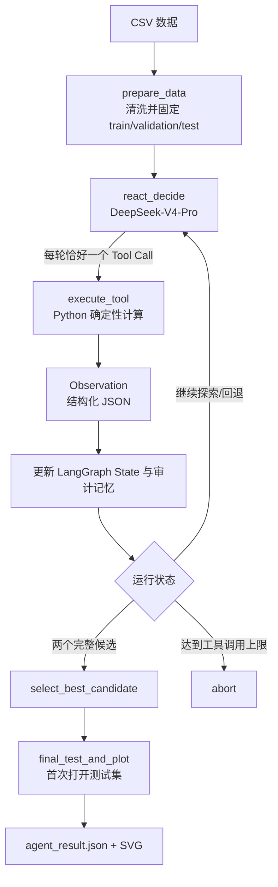
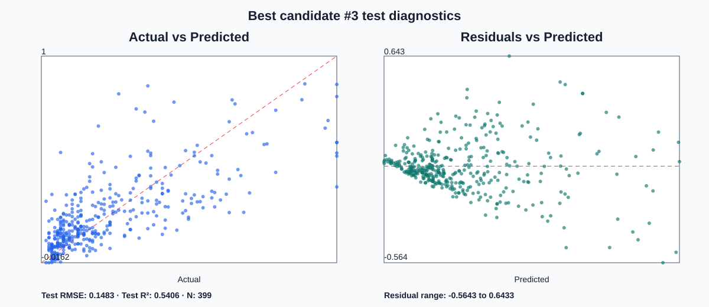

# Multi-variable Regression Agent

一个由 DeepSeek-V4-Pro 驱动的多元线性回归 ReAct Agent。LLM 每轮只负责选择下一项行动；数据切分、OLS 拟合和所有统计量都由确定性的 Python 工具计算，模型不能自行编造统计结果。

本项目的目标不是让 MSE 达到一个人为固定阈值，而是让 Agent 从候选变量中探索不同模型，实时观察 adjusted R²、F-statistic、t-statistic、RMSE 和 VIF，淘汰不理想的方案，最终比较两个完整候选并给出有依据的选择说明。

## 核心特性

- 真正的逐步 ReAct：`思考/决策 → 调用一个工具 → 观察结果 → 调整下一步`。
- 每个统计量都是独立工具，Agent 可在得到某项结果后立即修改或放弃模型。
- 显式回退机制：被淘汰模型、失败原因和下一步变量计划都会进入记忆。
- 两个候选完成全部五项统计检查后，才允许进入最终比较。
- 训练、验证和测试集在一次运行中固定；最终模型选定前，Agent 无法看到测试集结果。
- 全量保存工具调用、观察结果、模型决策和每个候选的独立轨迹。
- 支持 DeepSeek 思考模式下的多轮 Tool Calls，并正确回传内部 `reasoning_content`。
- 提供无 API 的确定性策略，用于测试相同的 LangGraph 工具循环。

## Agent 架构



主图定义在 [`core/react_agent.py`](core/react_agent.py)，状态结构在 [`core/state.py`](core/state.py)，工具实现位于 [`core/react_tools.py`](core/react_tools.py)。

## ReAct 如何运行

每次进入 `react_decide`，DeepSeek 会收到项目背景、目标变量、全部候选变量、当前候选、已完成候选、已淘汰尝试，以及此前的消息和工具观察。模型必须调用一个工具，不能在没有工具结果时自行计算统计量。

一个候选的典型生命周期如下：

```text
start_candidate
    ↓
test_vif
    ↓
fit_candidate
    ↓
test_adjusted_r2 / test_f_stat / test_t_stat / test_rmse
    ↓
accept_candidate 或 abandon_candidate
```

五个统计工具没有强制固定顺序，不过除 VIF 外的拟合统计量都要求模型已经完成 `fit_candidate`。`accept_candidate` 具有硬性守卫：只有拟合完成并且五项统计工具全部调用过的候选才能被接受。

### 统计工具

| 工具 | 返回内容 | 决策方向 |
|---|---|---|
| `test_adjusted_r2` | Adjusted R² | 越高通常越好，同时惩罚无效变量 |
| `test_f_stat` | F-statistic、F p-value、整体显著性 | 结合 p-value 判断模型整体是否有效 |
| `test_t_stat` | 每个系数、标准误、t-stat、p-value | 发现不显著或不稳定的变量 |
| `test_rmse` | Train RMSE、Validation RMSE | 越低越好，并观察泛化差距 |
| `test_vif` | 每个变量 VIF、最大 VIF、严重度 | 越低越好，识别多重共线性 |

### 生命周期与控制工具

- `inspect_dataset`：查看数据规模、字段和候选池。
- `start_candidate`：创建一个未尝试过的变量组合。
- `fit_candidate`：在固定训练集上拟合 OLS。
- `abandon_candidate`：记录淘汰原因和下一步变量计划，然后退回变量选择。
- `accept_candidate`：将通过全部统计检查的候选加入完成列表。
- `inspect_history`：主动检查已完成和已淘汰历史。
- `select_best_candidate`：排名两个完整候选，并生成比较解释与风险说明。

## 记忆管理

记忆不是一段自由文本，而是 LangGraph State 中的结构化数据。一次运行内包含三层记忆：

| 记忆层 | State 字段 | 用途 |
|---|---|---|
| 对话/观察记忆 | `messages` | 顺序保存 LLM Tool Call 与工具返回的 `ToolMessage` |
| 模型工作记忆 | `active_candidate`、`completed_candidates`、`discarded_attempts`、`attempted_feature_sets` | 保存当前进度、历史统计、淘汰原因并防止变量组合重复 |
| 审计记忆 | `tool_call_history`、`decision_log`、候选内的 `tool_trace` | 回放每次调用的参数、观察、状态、理由和所属候选 |

每次 LLM 决策实际接收：

```python
[
    SystemMessage(content=_system_prompt(state)),
    *state["messages"],
]
```

`_system_prompt(state)` 会重新序列化以下快照：

- 当前活动候选及已获得的统计量；
- 两个完整候选及其工具轨迹；
- 所有已淘汰尝试、淘汰原因和 `next_feature_plan`；
- 项目背景、目标、候选变量池和统计判断原则。

这使 Agent 不只是“记得调用过工具”，而是能够看到先前模型为什么失败，并据此选择新的变量组合。`attempted_feature_sets` 在工具层再次阻止重复，即使 LLM 忘记历史也不能重复提交相同组合。

DeepSeek 返回的 `reasoning_content` 只用于满足思考模式下的多轮工具协议，保存在消息对象内部并回传下一轮；它不会写入最终结果。公开结果只保存可审计的工具选择、参数、统计观察和用户可读的决策理由。

当前记忆是**单次运行范围**的：程序重新启动时不会自动继承上一轮实验。如果需要跨运行长期记忆，可以在后续版本加入 LangGraph checkpointer 或外部数据库。

## 回退机制

工具结果不会自动决定去留，而是立即返回给决策层。例如：

```text
test_t_stat
  → Observation: PctPopUnderPov p=0.764，不显著
  → DeepSeek 调用 abandon_candidate
  → 记忆保存失败原因与下一步替换计划
  → active_candidate 清空
  → 下一轮 react_decide 重新调用 start_candidate
```

如果 VIF 严重、t 检验不显著、验证 RMSE 相对较差，或 Agent 发现其他统计风险，都可以立即放弃当前候选。被淘汰尝试不计入两个最终候选，但始终保留在 `discarded_attempts` 中供后续决策参考。

## 数据泄漏防护

一次运行开始时数据被固定分为：

- 60% training：拟合和训练统计量；
- 20% validation：候选比较所需 RMSE；
- 20% test：模型选择完成后才使用一次。

缺失值填补值和类别编码列只从训练集学习，然后应用到验证集和测试集。比较阶段看不到测试指标，因此不会用测试集反复调变量。

## 安装与配置

```bash
python3 -m venv venv
source venv/bin/activate
pip install -r requirements.txt
cp .env.example .env
```

在 `.env` 中设置：

```dotenv
DEEPSEEK_API_KEY=your-key
```

API Key 和模型名位于 [`configs/setting.py`](configs/setting.py)。其他需要人工调整的内容全部集中在 [`configs/agent_config.py`](configs/agent_config.py)，包括：

- 数据文件、项目背景、任务描述和目标变量；
- 候选变量池；
- 候选数量、最大尝试次数和最大 ReAct 工具调用数；
- p-value 与 VIF 提示阈值；
- train/validation/test 比例和随机种子；
- 缺失值填补、类别编码和输出目录；
- DeepSeek thinking mode、reasoning effort、temperature 和 timeout。

## 运行

使用配置文件中的默认任务：

```bash
python main.py
```

指定自己的数据：

```bash
python main.py data.csv \
  --target price \
  --features area rooms age location \
  --query "Build an interpretable house-price regression" \
  --result-dir result/house_price
```

`--result-dir` 会把完整的 `agent_result.json` 和最终测试集诊断图写入同一个目录。

不调用 LLM、只验证工具循环：

```bash
python main.py test/test.csv \
  --target target \
  --features x1 x2 category \
  --no-use-llm \
  --result-dir result/offline_smoke
```

## Communities and Crime 实验

### 数据集

[UCI Communities and Crime](https://archive.ics.uci.edu/dataset/183/communities%2Band%2Bcrime) 包含 1,994 个美国社区，结合了 1990 Census、1990 LEMAS 和 1995 FBI UCR 数据。原始数据有 122 个可预测变量，目标 `ViolentCrimesPerPop` 被归一化到 0–1。UCI 将 `state`、`county`、`community`、`communityname` 和 `fold` 标记为非预测字段，本实验在建模前将它们删除。

数据集引用：Redmond, M. (2002). *Communities and Crime*. UCI Machine Learning Repository. [DOI: 10.24432/C53W3X](https://doi.org/10.24432/C53W3X). 数据采用 CC BY 4.0。

仓库包含原始数据、字段说明、整理后的 CSV，以及可复现整理脚本：

```bash
python scripts/prepare_communities_and_crime.py \
  data/communities_and_crime/communities.data \
  data/communities_and_crime/communities.names \
  data/communities_and_crime/communities_and_crime_model.csv
```

整理结果：1,994 行、122 个预测变量、1 个目标变量；23 个字段包含缺失值，共 36,851 个缺失单元，由 Agent 使用训练集统计量填补。

### 实际 ReAct 轨迹

DeepSeek-V4-Pro 共执行 39 次工具调用，创建 5 个不同变量组合，淘汰 3 个尝试，并完成 2 个候选：

| 尝试 | 结果 | 触发决策 |
|---|---|---|
| Candidate 1 | 淘汰 | `PctPopUnderPov` 不显著，p=0.764 |
| Candidate 2 | 淘汰 | 替换变量后 `PctNotHSGrad` 不显著，p=0.454 |
| Candidate 3 | 接受 | 五个变量全部显著，Validation RMSE=0.1557 |
| Candidate 4 | 淘汰 | `PctBSorMore` 不显著，p=0.826 |
| Candidate 5 | 接受 | 五个变量全部显著，Validation RMSE=0.1786 |

这条轨迹展示了记忆和回退的实际作用：每次淘汰原因与下一步计划被写入状态，下一候选针对上一轮的不显著变量进行删减，而不是重新使用全部字段。

### 两个完整候选

| Candidate | Variables | Adjusted R² | F-statistic | F p-value | Validation RMSE | Max VIF | 显著变量比例 |
|---|---|---:|---:|---:|---:|---:|---:|
| **3（最佳）** | `PctUnemployed`, `racepctblack`, `PctFam2Par`, `agePct12t21`, `PctIlleg` | **0.5984** | **357.0934** | 7.81e-234 | **0.1557** | 5.2909 | 100% |
| 5 | `medIncome`, `PctVacantBoarded`, `PctPersDenseHous`, `PctUsePubTrans`, `PctPolicBlack` | 0.4670 | 210.4222 | 7.20e-161 | 0.1786 | **1.4022** | 100% |

最佳候选的 t 检验：

| Variable | Coefficient | t-statistic | p-value |
|---|---:|---:|---:|
| `PctUnemployed` | 0.0858 | 2.9525 | 0.00321 |
| `racepctblack` | 0.1023 | 3.4848 | 0.000510 |
| `PctFam2Par` | -0.2969 | -6.9627 | 5.51e-12 |
| `agePct12t21` | -0.1423 | -5.0031 | 6.49e-7 |
| `PctIlleg` | 0.4277 | 9.9930 | 1.24e-22 |

DeepSeek 选择 Candidate 3：它的最大 VIF 高于 Candidate 5，但仍低于配置的严重共线性阈值 10；同时 adjusted R² 更高且 validation RMSE 更低。

### 未触碰测试集结果

| Metric | Result |
|---|---:|
| Test rows | 399 |
| RMSE | **0.148338** |
| MSE（由 RMSE 推导） | **0.022004** |
| R² | **0.540581** |



完整的统计观察、工具调用、回退理由和决策日志见 [`result/communities_and_crime/agent_result.json`](result/communities_and_crime/agent_result.json)，简版实验报告见 [`result/communities_and_crime/test_report.md`](result/communities_and_crime/test_report.md)。

### 实验限制

- “最佳”表示两个完整候选中的最佳，不等于穷举 122 个变量的所有组合。
- 当前结果来自一次固定随机切分，尚未加入 K-fold cross-validation。
- 反复基于 t 检验筛选变量会使最终普通 OLS p-value 偏乐观。
- `racepctblack`、`PctIlleg` 等变量涉及敏感人口属性或代理信息。本实验只用于统计与 Agent 架构研究，不能据此作因果解释，也不应直接用于执法、信贷或资源分配等高风险决策。
- 残差图显示高预测区间误差更大，后续可研究交互项、非线性模型、稳健标准误或加权回归。

## 测试

```bash
python -m pytest -q
```

当前测试结果：`6 passed`。测试覆盖两个唯一完整候选、五个独立统计工具、接受守卫、VIF 即时淘汰、LLM Tool Call 协议、DeepSeek 思考内容回传、工具与决策记忆、最终比较、测试集隔离及 SVG 生成。

## 项目结构

```text
configs/
  agent_config.py            # 所有人工可调的 Agent/统计配置
  setting.py                 # API Key 环境变量与模型名
core/
  deepseek_llm.py            # DeepSeek Chat Completions + Tool Calls 适配
  react_agent.py             # LangGraph ReAct 状态图与提示词记忆注入
  react_tools.py             # 数据处理、统计工具、状态变更和最终图
  state.py                   # LangGraph State 结构
data/communities_and_crime/  # UCI 原始与整理后数据
result/communities_and_crime/# 完整实验 JSON、报告和诊断 SVG
scripts/                     # 数据整理脚本
test/                        # 单元与端到端测试
main.py                      # CLI 和 Agent 入口
```
